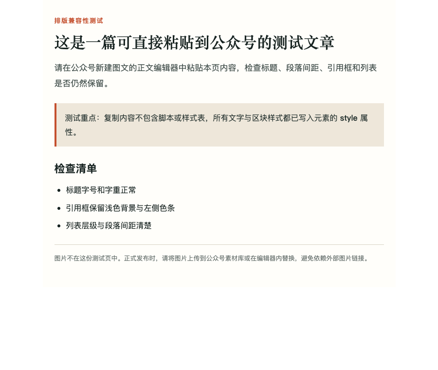

<p align="center">
  
  
  
  
</p>

<h1 align="center">公众号 AIP 打造</h1>
<h1 align="center">想要加入自媒体AI破局社群可联系微信：JZX_AI1203</h1>

<h3 align="center">一套可被任意 AI 工具接入的实战方法论 · A Tool-Agnostic AI Methodology for Building a WeChat AIP</h3>

<p align="center">
  把「公众号 AIP 打造」的完整方法论，封装成一份 <b>工具无关</b> 的 AI 知识包 —— 适配 WorkBuddy · Claude · ChatGPT · Gemini · Cursor · 通义 · 文心等任意 AI 工具。<br/>
  A complete, <b>tool-agnostic</b> knowledge pack for building a WeChat Official Account "AIP" (AI + Personal IP) — works with <b>any</b> AI tool: WorkBuddy, Claude, ChatGPT, Gemini, Cursor, and more.
</p>

---

## 🌟 这是什么 · What is this?

> **AIP = AI + 个人 IP（Personal IP）**
> 一个把「AI 工具专业度」和「可辨识的人格化表达」结合起来的垂直公众号。不是搬运工，也不是纯干货机器 —— 而是能被粉丝记住、信任、并为之付费的真实人设。

**中文** · 这是一套公众号 AIP 运营方法论：从定位、搭建、对标、选题、写作到排版，一条龙闭环，拆成 5 个可渐进加载的模块 + 3 个内容模板 + 4 个 HTML 图文模板。它**不绑定任何 AI 工具** —— 你把它喂给任何 AI，AI 就会按方法论给你产出可交付物。同时，它也原生打包成一个 WorkBuddy Skill，可一键安装自动触发。

**English** · This is a complete WeChat AIP operating methodology: positioning, setup, benchmarking, topics, writing, and formatting, end to end, split into 5 progressively-loaded modules plus 3 content templates and 4 HTML article templates. It is **not tied to any single AI tool** — feed it to any AI and it will produce deliverables following the method. It also ships as a native WorkBuddy Skill for one-click install and auto-trigger.

**为什么「牛逼」· Why it's powerful:**

- 🤖 **任意 AI 都能用** · Tool-agnostic — 不锁平台。WorkBuddy 当 Skill 用，Claude/ChatGPT/Gemini/Cursor 直接当知识库喂进去。
- 🧭 **全闭环** · Full loop: 定位 → 搭建 → 对标 → 选题 → 写作 → 排版，一步不漏。
- 🖼️ **图文直接出样** · 3 个内容模板 + 4 个 HTML 图文模板（含 1200×630 宣传卡）；长文、教程与观点模板可导出为公众号可粘贴的内联富文本，文章与宣传图可以一起产出。
- 🚦 **踩坑护栏** · Guardrails built in: 5 条红线（密钥不外泄、对标≠洗稿、不承诺收益…）写进方法论内核，任何模块默认遵守。
- 🌐 **双语** · Bilingual: 本 README 与方法论均为中英双语，面向全球创作者。

- 🤖 **Any AI, not just one** · Tool-agnostic — no vendor lock-in. Use as a WorkBuddy Skill, or drop it into Claude/ChatGPT/Gemini/Cursor as context.
- 🧭 **Full loop**: positioning → setup → benchmark → topics → writing → formatting, nothing skipped.
- 🖼️ **Picture-first output**: 3 content templates plus 4 HTML article templates, including a 1200×630 promotion card.
- 🚦 **Guardrails built in**: 5 non-negotiable bottom lines (secrets stay secret, benchmark ≠ plagiarism, no income promises…) are baked into the core.
- 🌐 **Bilingual**: this README and the methodology are bilingual for a global creator audience.

---

## 🧪 公众号粘贴效果验证 · Paste Test

长文、教程和观点模板可把浏览器已渲染的内容导出为内联富文本：不带 `<script>` 或 `<style>` 标签，标题、段落、引用框和列表样式都写在元素自身。下面是随包测试页的实际预览效果：



可直接打开 [wechat-paste-test.html](assets/wechat-html-templates/wechat-paste-test.html)，全选复制后粘贴到公众号新建图文的正文编辑器中检查效果。正式文章的图片请在公众号后台上传或替换；发布前以草稿箱预览为准。

The long-form, tutorial, and opinion templates export rendered content as inline rich text: no `<script>` or `<style>` tags, with heading, paragraph, quote, and list styles on the elements themselves. Open [wechat-paste-test.html](assets/wechat-html-templates/wechat-paste-test.html), copy it into a new Official Account draft, and check the result in the current backend.

---

## 🤖 任意 AI 工具都能接入 · Works with ANY AI Tool

本仓库的核心是 `UNIVERSAL.md` + `references/` + `assets/` —— **纯 Markdown，零依赖**。任何能读文件的 AI 都能直接消费：

| AI 工具 Tool | 怎么用 How to use |
|------|------|
| **WorkBuddy** | 当 Skill 用：`git clone` 后 `cp -r wechat-aip-architect ~/.workbuddy/skills/`，自动触发。详见下方「安装」。Use as a Skill (auto-trigger). |
| **Claude / Claude Code** | 把 `UNIVERSAL.md` + `references/` 放进项目目录作为上下文；或在 `CLAUDE.md` 里引用。Drop `UNIVERSAL.md` + `references/` into the project as context. |
| **ChatGPT (Plus/Team)** | 把 `UNIVERSAL.md` 和需要的 `references/*.md` 上传为 Project 文件，或直接粘贴进自定义指令。Upload as Project files, or paste into custom instructions. |
| **Gemini / 通义 / 文心** | 同理：上传文件或把内容贴进对话。Same: upload files or paste content into chat. |
| **Cursor / 其他 IDE Agent** | 把仓库加入 workspace，引用 `UNIVERSAL.md` 即可。Add the repo to the workspace and reference `UNIVERSAL.md`. |
| **通用做法 Generic** | 直接把对应模块的 `.md` 内容贴进对话框，配一句指令（如「按 03 模块的 5+3 拆解法，拆这篇爆款」）。Just paste the relevant `.md` into chat with a one-line instruction. |

> 💡 没有任何插件、密钥或安装步骤。对不支持"项目文件"的纯聊天工具，复制粘贴就是最快的接入方式。
> No plugin, key, or install step. For plain chat tools without "project files", copy-paste is the fastest way in.

---

## 🗺️ 工作流 · The Workflow

```
  ① 定位          ② 搭建           ③ 对标           ④ 选题
 Positioning  →   Setup      →   Benchmark     →   Topics
  人/货/场        8种变现        找对标3维度       5大选题来源
                  流量主          5+3拆解法        文章4要素

      ⑥ 排版                               ⑤ 写作
   Format (HTML 模板)      ←───────────────   Writing
   图文预览 + 宣传卡          换元法          开头/正文/结尾
```

---

## 📂 目录结构 · Directory Structure

```
wechat-aip-architect/
├── README.md              # 本文件 · This file (bilingual)
├── UNIVERSAL.md           # 通用 AI 方法论入口（工具无关，任意 AI 可喂）· Tool-agnostic entry
├── LICENSE                # MIT 许可证
├── SKILL.md               # WorkBuddy 专用入口 · WorkBuddy-only entry (frontmatter)
├── references/            # 5 个方法论模块 · 5 methodology modules
│   ├── 01-positioning.md          #   定位 / 商业模式 / 垂直细分
│   ├── 02-account-setup.md        #   账号搭建 / 8种变现 / 流量主
│   ├── 03-benchmark-analysis.md   #   对标3维度 / 5+3拆解法 / 对标库
│   ├── 04-writing-publishing.md   #   选题 / 换元法 / 排版SOP
│   └── 07-prompts-optimization.md #   IP 提示词 / 文章优化
├── assets/                # 3 个可复用模板 · 3 reusable templates
│   ├── benchmark-template.md      #   飞书多维表格字段设计
│   ├── article-structure.md       #   文章结构框架（可套用）
│   └── prompt-templates.md        #   5 类提示词模板
│   └── wechat-html-templates/     #   4 个 HTML 图文与宣传卡模板
└── dist/
    └── wechat-aip-architect.zip   # WorkBuddy 打包产物 · Packaged skill (WorkBuddy install-ready)
```

> `UNIVERSAL.md` 与 `SKILL.md` 内容等价：`UNIVERSAL.md` 面向**任意 AI 工具**（无 frontmatter），`SKILL.md` 是 WorkBuddy 的带元数据版本。两者保持同步。
> `UNIVERSAL.md` and `SKILL.md` are equivalent in content: `UNIVERSAL.md` targets **any AI tool** (no frontmatter); `SKILL.md` is the WorkBuddy metadata version. They are kept in sync.

---

## 📦 安装 · Installation

### 方式 A：作为 WorkBuddy Skill（自动触发）

```bash
# 1. 克隆仓库 · Clone the repo
git clone https://github.com/chenjin-cmd/wechat-aip-architect.git

# 2. 复制到 WorkBuddy 技能目录 · Copy into your WorkBuddy skills folder
cp -r wechat-aip-architect ~/.workbuddy/skills/wechat-aip-architect

# 3. 重启 / 刷新 WorkBuddy 即可触发 · Restart/refresh WorkBuddy to activate
```

触发关键词（仅 WorkBuddy）· **Trigger keywords (WorkBuddy only)**: `公众号` `AIP` `爆款拆解` `对标` `选题` `排版` `HTML图文` `宣传配图` `引流` `流量主` `写作提示词` `个人IP`

### 方式 B：接入任意其他 AI 工具（无需安装）

直接把 `UNIVERSAL.md` + 需要的 `references/*.md` 交给你的 AI 即可 —— 上传为项目文件、粘贴进对话，或放进 IDE workspace。详见上方「任意 AI 工具都能接入」。
Simply hand `UNIVERSAL.md` + the relevant `references/*.md` to your AI — upload as project files, paste into chat, or drop into your IDE workspace. See "Works with ANY AI Tool" above.

---

## 🧩 模块速查 · Module Cheat-Sheet

| # | 模块 Module | 中文核心 | Core (EN) | 触发信号 Trigger |
|---|-----------|---------|-----------|----------------|
| 01 | Positioning | 人/货/场定位、商业模式、垂直细分 | Person/Product/Scene framing, business model, niche | "怎么定位 / 做什么方向 / AIP是什么" |
| 02 | Account Setup | 8种变现、流量主、涨粉、绑卡 | 8 monetization paths, traffic-master, growth | "注册 / 开通流量主 / 怎么变现" |
| 03 | Benchmark | 对标3维度、5+3拆解法、对标库 | 3-dimension benchmarking, 5+3 teardown, library | "找对标 / 拆爆款 / 低粉爆文" |
| 04 | Writing | 5大选题、换元法、HTML 图文模板与宣传卡 | 5 topic sources, substitution method, HTML templates | "找选题 / 写文章 / HTML图文 / 宣传配图" |
| 07 | Prompts | IP人设提示词、文章对比优化（含爆款潜力分析） | IP persona prompts, article optimization (incl. viral-potential analysis) | "写作提示词 / 让AI改文章 / 分析爆款潜力" |

---

## 🚀 使用示例 · Usage Examples

> 把下面任意一句，连同对应的 `references/*.md` 一起交给你的 AI（中英文皆可）· Hand any line below, plus the relevant `references/*.md`, to your AI (Chinese or English both work):

**中文**
```
帮我做一个公众号 AIP 定位，我擅长 AI 工具测评，目标用户是想用 AI 提效的职场人。
拆一篇最近的低粉爆文给我看，用 03 模块的 5+3 拆解法。
给我一篇关于「用 AI 做公众号排版」的文章草稿，按 04 模块的文章4要素写，并配一套 HTML 图文模板和宣传卡。
用 07 模块的提示词，帮我分析这篇爆款的潜力并产出选题灵感。
```

**English**
```
Help me position my AIP — I'm good at reviewing AI tools, target users are professionals who want to work smarter with AI.
Break down a recent low-follower viral post for me using module 03's 5+3 method.
Draft an article on "using AI for WeChat article formatting" following module 04's 4-element structure, with an HTML template and promotion card.
Use module 07's prompts to analyze this post's viral potential and give me topic ideas.
```

---

## 🚦 五条底线 · Five Non-Negotiable Bottom Lines

1. **平台规则随时变** · Platform rules change — always defer to the current Official Account backend & official policies.
2. **收益不作承诺** · No income promises — all metrics are reference only, never a guarantee.
3. **对标 ≠ 洗稿** · Benchmark ≠ plagiarism — add your own experience, viewpoint, data, and voice.
4. **变现先核验** · Verify before monetizing — check qualifications for ads, affiliates, and courses.
5. **密钥不外泄** · Secrets stay secret — AppSecret / API Key / Token live only in a password manager or env vars, never in public notes, screenshots, or repos.

---

## 🤝 贡献 · Contributing

欢迎提 Issue 和 PR！无论是补充新的对标渠道、优化提示词，还是增加更多可复用模板，都很有价值。
Issues and PRs are welcome — new benchmark channels, better prompts, or extra reusable templates all help.

1. Fork 本仓库 · Fork this repo
2. 新建分支 `feat/your-idea` · Create a branch `feat/your-idea`
3. 提交改动并说明 · Commit with a clear message
4. 发起 Pull Request · Open a Pull Request

> 维护约定 · **Maintenance note**: 改 `SKILL.md` 时，请同步 `UNIVERSAL.md`（两者内容等价）。When editing `SKILL.md`, please sync `UNIVERSAL.md` (equivalent content).

## 🙏 HTML 模板来源 · Attribution

内置模板为本项目独立编写，HTML 视觉预览工作流参考 [huashu-design](https://github.com/alchaincyf/huashu-design)，作者 alchaincyf（花叔／花生），采用 MIT 协议。详细说明见 [assets/wechat-html-templates/ATTRIBUTION.md](assets/wechat-html-templates/ATTRIBUTION.md)。

---

## 📄 许可 · License

[MIT](LICENSE) © 2026 Chen

---

<p align="center">
  <sub>Built with ❤️ for creators who want to turn AI expertise into a real, trusted personal brand — on any AI tool they choose.</sub>
</p>
